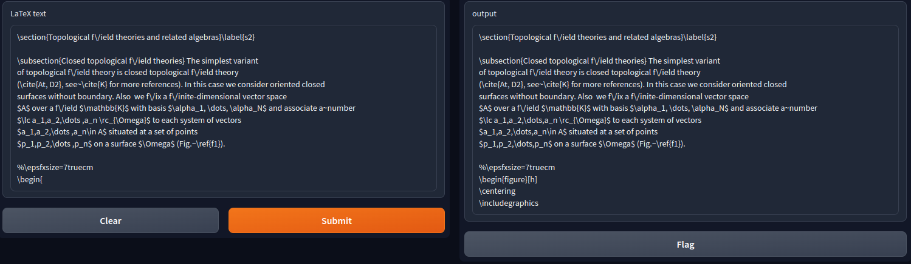

# AutoComplete-Stability

Install the requirements with

`pip install -r requirements.txt`

For training the model, see the `stablecode_training.ipynb` notebook.

For running our simple application, see the `stablecode_demo.ipynb` notebook.

